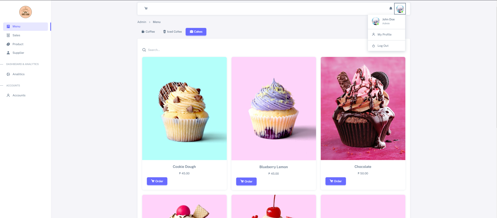
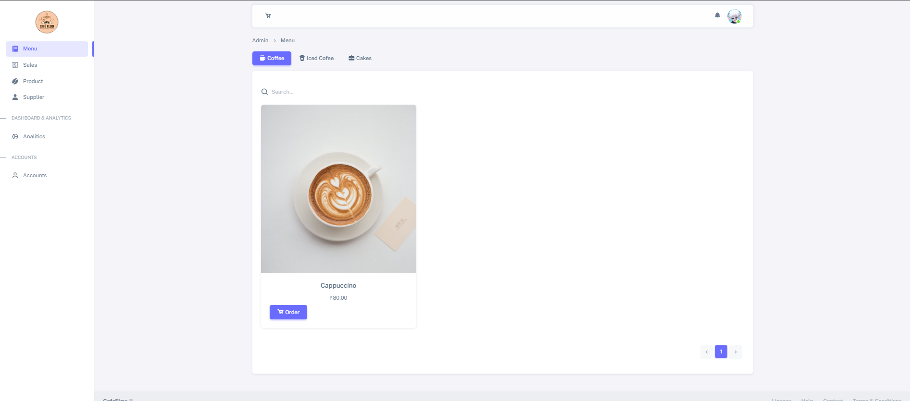
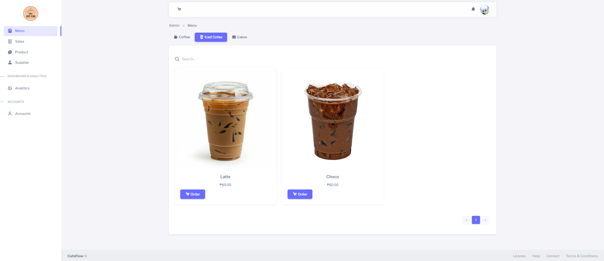
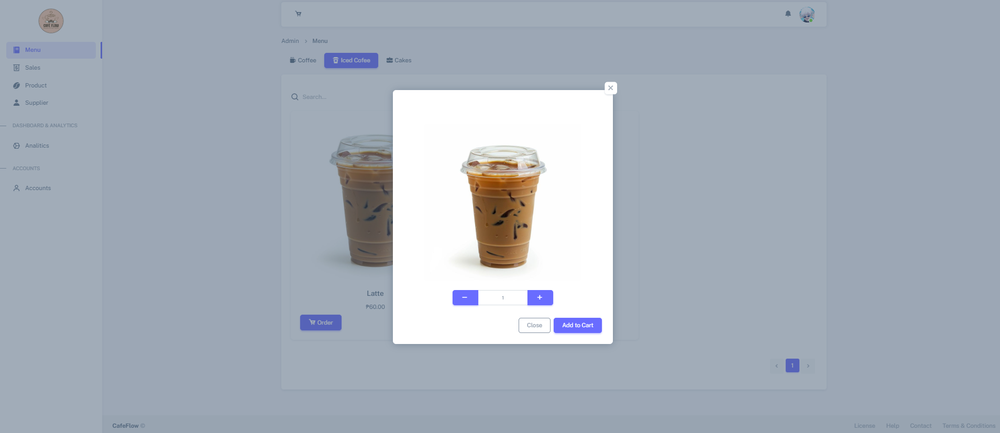
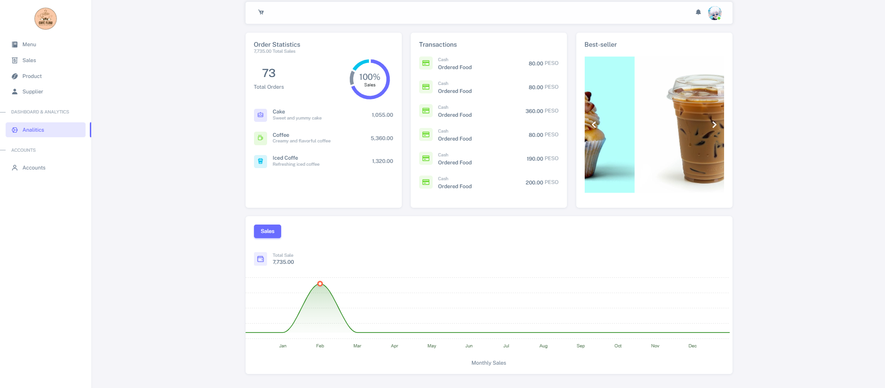
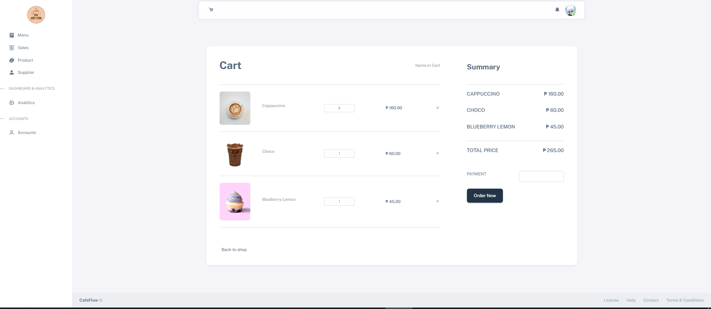
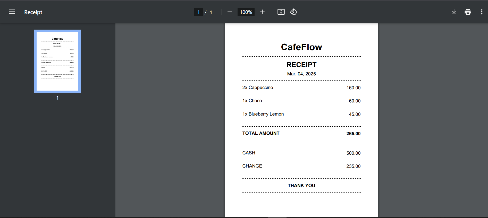

CafeFlow is a modern and intuitive café management system designed to streamline the ordering process, improve efficiency, and enhance customer experience. Below are key features of the system along with visual representations.

The CafeFlow POS system simplifies café management with an efficient, admin-focused design. It brings essential tools like menu management, sales tracking, inventory control, supplier coordination, analytics, and account management into one platform. By streamlining tasks such as tracking stock and monitoring sales, it reduces manual effort and improves accuracy. Its user- friendly interface and insightful analytics provide clear sales trends and product performance, enabling smarter, data-driven decisions. More than just a tool, Café Flow is a dependable partner that saves time, minimizes errors, and keeps your café running smoothly, allowing you to focus on delighting customers. II. ERD

Menu
The menu interface provides a visually appealing and easy-to-navigate selection of available items. Customers can browse through various categories, view images, and see prices.

Ordering System
The ordering interface allows customers to select items, customize orders, and proceed to checkout seamlessly.

Analytics Dashboard
CafeFlow includes an analytics dashboard that provides insightful data on sales, popular items, and customer trends, helping café owners make informed decisions.

Cart Interface
The cart interface allows users to review their selected items, adjust quantities, and proceed with their order.

Receipt Generation
Once an order is placed, a detailed receipt is generated for both the customer and the café staff, ensuring a smooth transaction.

